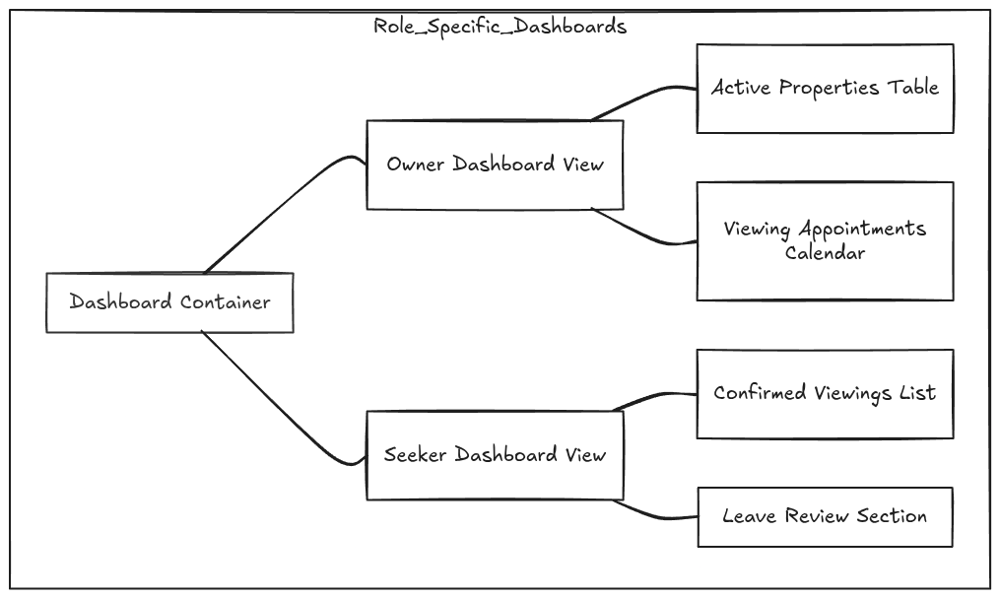
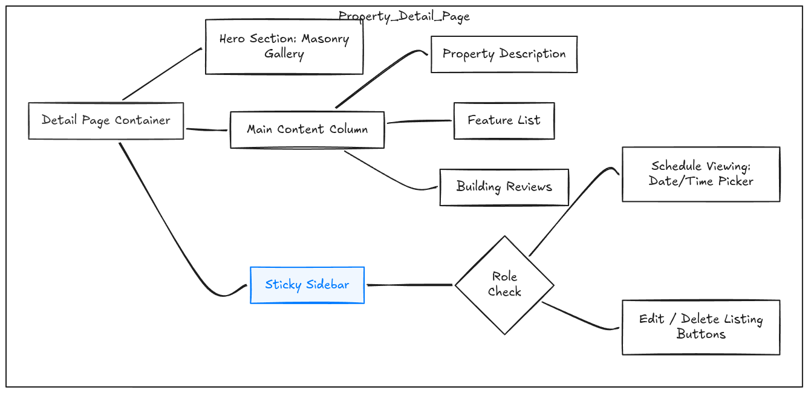
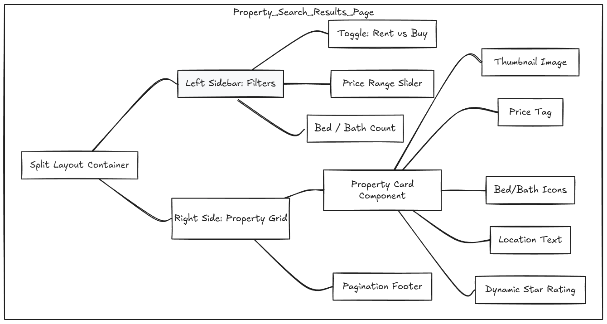
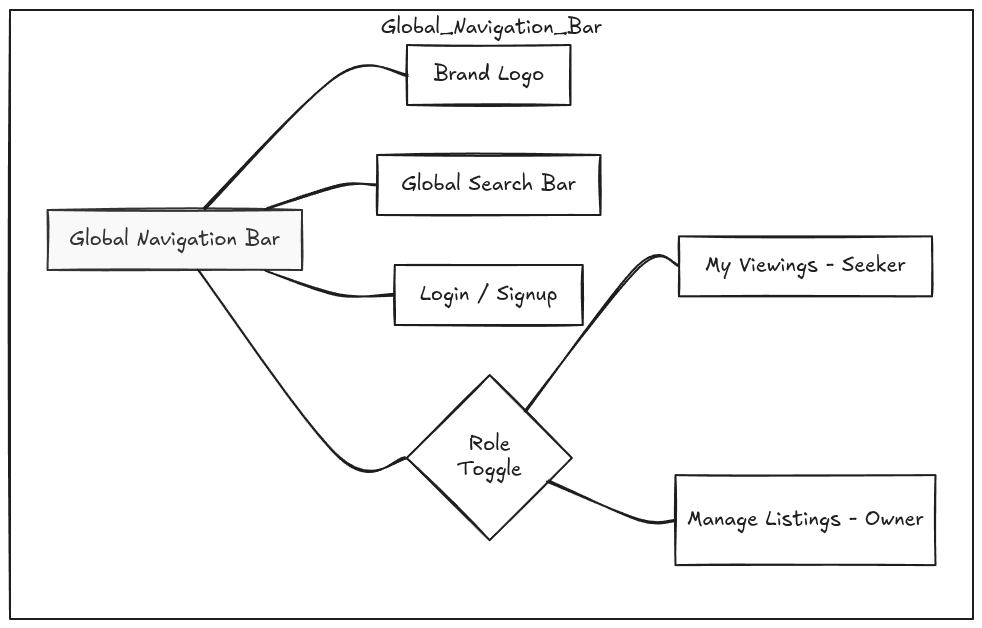
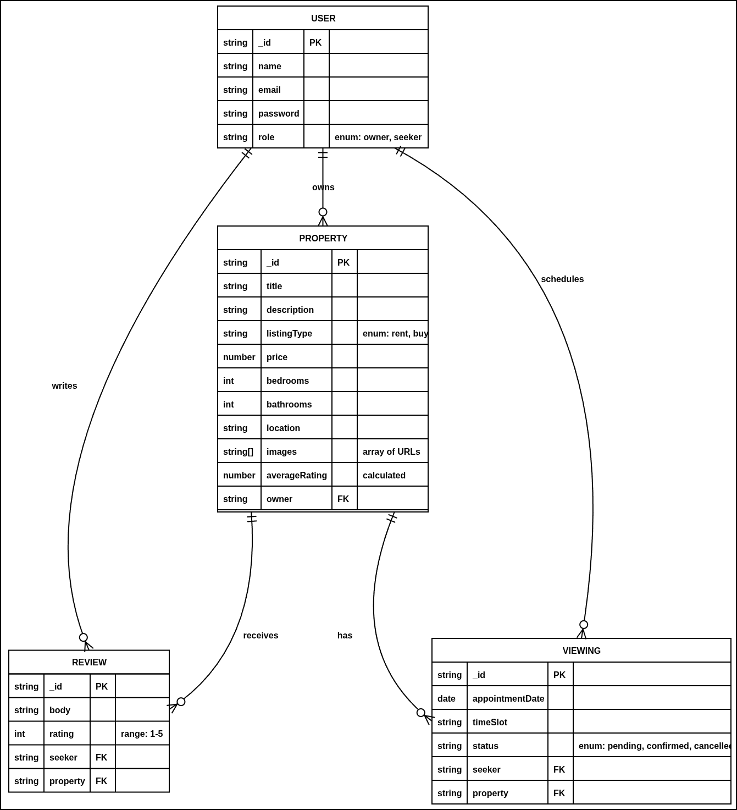

# Property Finder Alike:

# User Stories

## Identity & Roles

- **As a User (AAU)**, I want to register as an "Owner" (to list properties) or a "Seeker" (to find a home) so my dashboard matches my goals.

## Listings & Cloud Images (Owners Only)

- **As an Owner (AAO)**, I want to list a property for Sale or Rent, detailing the price, bedrooms, bathrooms, and square footage.
- **As an Owner (AAO)**, I want to upload high-resolution images of the rooms and a floorplan so that potential buyers/renters can inspect the property online.

## Search, Filtering & Pagination (Seekers)

- **As a Seeker (AAS)**, I want to filter search results by status (Rent/Buy), maximum price, and property type (Apartment/Villa) so I only see relevant homes.

## Viewing Appointments (Replacing "Bookings")

- **As a Seeker (AAS)**, I want to select an available date and time slot from a calendar on the listing to schedule an in-person viewing.
- **As an Owner (AAO)**, I want to see a schedule of all my upcoming property viewings so I can meet with potential clients.

## Reviews & Ratings (Seekers Only)

- **As a Seeker (AAS)**, I want to leave a rating and review on a property's building/neighborhood after visiting, so other seekers know about noise levels or maintenance quality.

#

# App Wireframes:

### 1. Role Specific Dashboards:

### 2. Property Detail Page:

### 3. Property Search Results Page:

### 4. Global Navigation Bar:

#

# ERD:

#
